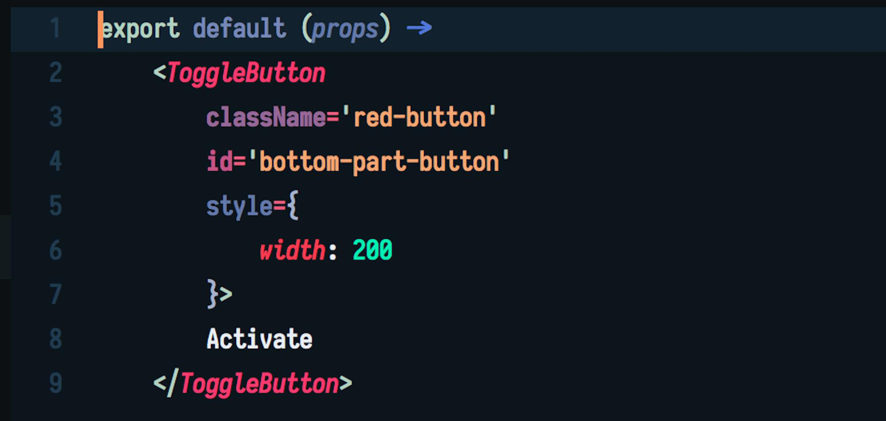
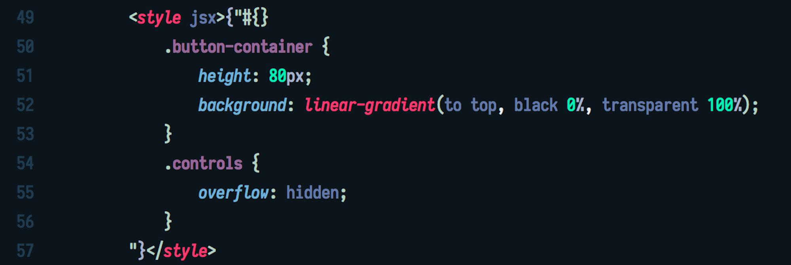
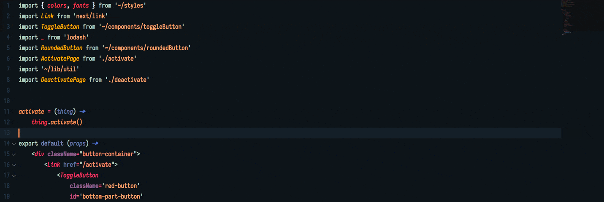
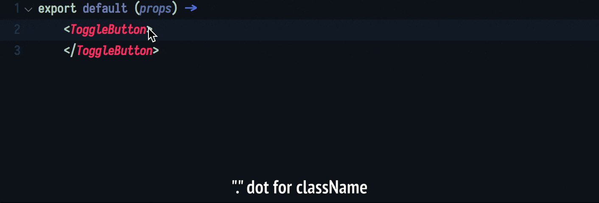
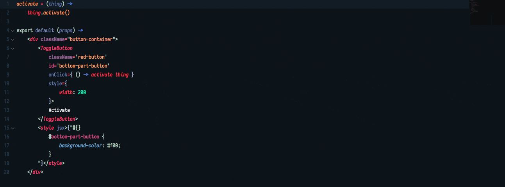

# Cup
### _For your daily dose of CoffeeScript_


## Installation

### With Package Control
> This is the recommended installation method.

* Open the Command Pallete (`ctrl+shift+P` or `cmd+shift+P`).
* Type "Install Package" and hit return.
* Type "Cup" and hit return.

### As a repository within the packages directory

Open a Terminal/Console and run the following commands, replacing `PACKAGE_PATH` with the path corresponding to your OS above.

    cd PACKAGE_PATH
    git clone https://github.com/alin23/Cup

Sublime stores packages in the following locations:

    Unix: ~/.config/sublime-text-3/packages
    Mac: ~/Library/Application\ Support/Sublime\ Text\ 3/Packages
    Win: %APPDATA%\Sublime Text 3\Packages

## Dependencies
```shell
npm install -g isort-coffee
```
or
```shell
yarn global add isort-coffee
```


## Features

- Syntax Highlighting for all the new features (including JSX and CSS/Styles JSX)


- Import sorting and grouping

- Lots of snippets (including React and Next.js support)
- All the features of [Better CoffeeScript](https://github.com/aponxi/sublime-better-coffeescript) and [React Coffee Snippets](https://github.com/monstersintokyo/react-coffee-sublime-snippets)
- Emmet-like attribute inserting inside JSX tags

- Proper symbol indexing
    - Classes
    - Functions
    - JSX Tags
    - JSX element classNames
    - JSX element IDs
    - Styled JSX CSS selectors

- Working Build Systems


## Thanks
- [Logan Howlett](https://github.com/aponxi)
- [περιπέτεια](https://github.com/monstersintokyo)

## License

Cup is distributed under the terms of both

- [MIT License](https://choosealicense.com/licenses/mit)
- [Apache License, Version 2.0](https://choosealicense.com/licenses/apache-2.0)

at your option.
